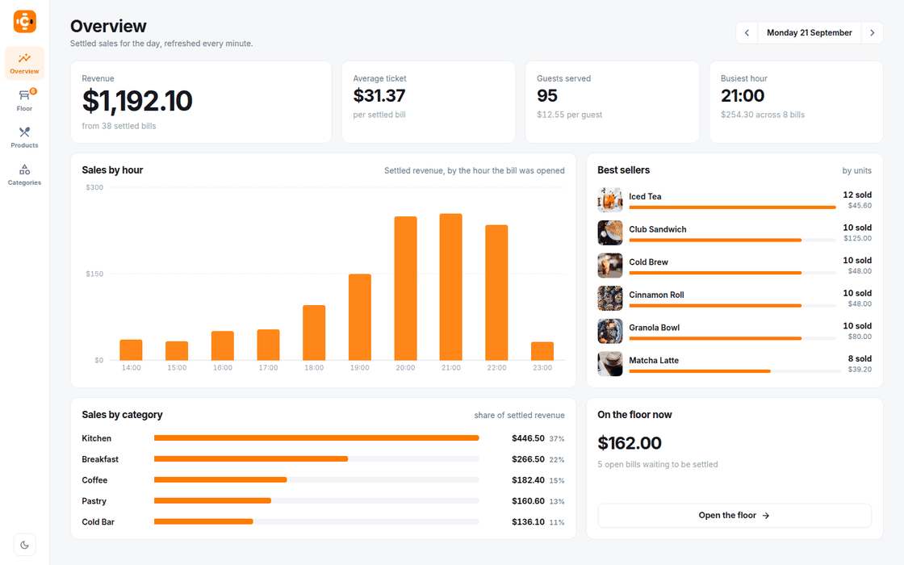
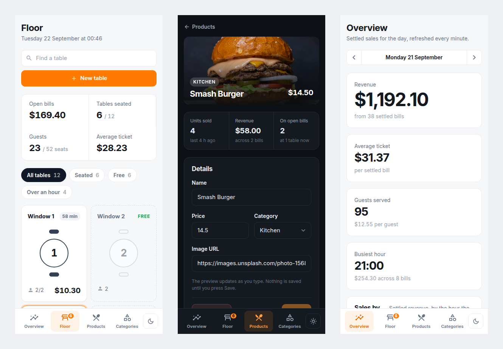

<div align="center">


# Contappa

Run the floor. Take the order. Split the bill.

[](https://github.com/nicolasgarea/contappa/actions/workflows/ci.yml)
[](https://spring.io/projects/spring-boot)
[](https://react.dev)
[](https://www.typescriptlang.org)
[](https://www.postgresql.org)
[](LICENSE)

<picture>
  
</picture>

</div>

<br/>

## Why this project?

Most point of sale software is a spreadsheet with buttons on it. You get a list of table numbers and a list of amounts, and the one thing a waiter needs to know, which table has been sitting there too long, is the one thing the screen does not tell you.

I wanted the floor to look like a floor. Tables you can recognise, chairs that fill up as people sit down, and a clock on every table that goes red before the guests do.

## How it works

A table goes from empty to paid in four steps:

```
Seven guests sit down at Terrace 10
              ↓
  Terrace 10  ·  7/8 seated  ·  35 min
  2× Fish & Chips   1× Club Sandwich   1× Craft Lager
              ↓
  Split  →  $31.80 stays here  ·  $27.00 moves to a new bill
              ↓
  Mark paid  →  lands in today's revenue
```

Every table on the floor tells you where it stands without opening it:

```
Floor
├── Free          ← dashed outline, empty chairs, how many it seats
├── Seated        ← chairs fill in, guest count, running total
├── Over 1 h      ← the clock turns amber
└── Over 1 h 30   ← the clock turns red
```

## What you can do

**Read the room at a glance.** Every table is drawn from above with its chairs around it. Pick one and its order, its last round and its total open next to the floor, without leaving it.

**Take an order as fast as you can tap.** The menu with photos on one side, the live bill on the other. Tap to add, step quantities and guests up and down, and keep several bills open on the same table.

**Split a bill without doing maths.** Move any quantity of any item to a new bill and watch both totals update. The server refuses a split that does not add up, shares the guests between the two and keeps the table's original clock running.

**Change a price in one click.** The menu is a table you can sort and search. Click a price, type, press Enter. Select a product to see how much of it has sold and how much is sitting on open bills right now.

**See how the day went.** Revenue, average ticket, guests served, sales by hour, best sellers and sales by category, for any day, in your own time zone.

**Use it anywhere, in the dark if you like.** The rail turns into a tab bar on a phone, and light and dark follow your system until you pick one.

<div align="center">

</div>

## Quick Start

Requires Docker, Java 21 and Node.js 20+.

```bash
make db_up
# PostgreSQL on :5432, created and seeded from docker/initdb.sql

SPRING_DATASOURCE_URL=jdbc:postgresql://localhost:5432/contappa_db \
  ./contappa-core/mvnw -f contappa-core spring-boot:run
# http://localhost:8080

cd contappa-web
cp .env-example .env
npm install
npm run dev
# http://localhost:5173
```

The seed gives you thirty products, twelve tables, six open bills and a day of settled sales, so every screen has something on it the first time you open it. `make db_reload` wipes it and starts over.

To run the API and the database in containers instead:

```bash
make deploy
```

After changing the contract in `doc/openapi.yaml`, regenerate the TypeScript types:

```bash
cd contappa-web && npx openapi-ts
```

## Tests

```bash
make test       # unit tests: services, mappers, reports
make check      # Checkstyle
make ci-tests   # builds the API image and runs the Postman collection against it
```

CI runs all three on every pull request, plus a lint of the OpenAPI contract.

## The API

```
/tables
├── GET  POST                          ← the floor, with every open bill inline
└── /{id}
    ├── GET  PATCH  DELETE
    └── /bills
        ├── GET  POST
        └── /{billId}
            ├── GET  PATCH  DELETE
            ├── POST /split            ← parts must add up to the original
            └── POST /pay

/categories
├── GET  POST
└── /{id}
    ├── GET  PATCH  DELETE
    └── /products
        ├── GET  POST
        └── /{productId}               ← GET  PATCH  DELETE

/reports
├── GET /daily?date=&zone=             ← revenue, hours, best sellers, categories
└── GET /products/{productId}          ← units sold, revenue, units on open bills
```

Every `PATCH` is partial: leave a field out and it is left alone. Every error has the same shape, `{ "code": 409, "message": "…" }`: `404` for something that is not there, `400` for something that makes no sense, `409` for something that is still in use.

## Project Structure

```
contappa-core/src/main/java/com/contappa/core/
├── controllers/         ← tables, bills, categories, products, reports
├── services/            ← the rules: totals, splits, partial updates, reports
├── repositories/        ← Spring Data JPA
├── mappers/             ← MapStruct, entity to DTO and back
├── dto/                 ← request and response models, one folder per entity
├── models/              ← JPA entities
└── exceptions/          ← one handler, one error shape

contappa-web/src/
├── api/
│   ├── __generated__/   ← OpenAPI-generated types (do not edit)
│   ├── client/          ← axios services, one per resource
│   └── hooks/           ← TanStack Query hooks
│
├── components/
│   ├── ui/              ← Button, Modal, Chip, SearchField, TableGlyph…
│   ├── Product/         ← the photo-led hero and the sales figures
│   ├── Brand/           ← the logo
│   └── AppShell/        ← rail on desktop, tab bar on a phone
│
├── pages/
│   ├── OverviewPage/    ← the day in numbers, with the hourly chart
│   ├── RootPage/        ← the floor and the selected table
│   ├── TableDetailPage/ ← the order screen and the split flow
│   ├── ProductsPage/    ← the menu table with inline prices
│   ├── ProductDetailPage/
│   └── CategoriesPage/
│
├── styles/              ← one token shape, a light and a dark theme
└── lib/                 ← currency formatting

doc/                     ← OpenAPI contract, database diagram, screenshots
docker/                  ← Compose file, schema and seed
postman/                 ← integration test collection
```

## Roadmap

- [ ] Staff — who is serving which table
- [ ] Floor plan — place tables where they really are
- [ ] Receipts — print or send the bill
- [ ] Accounts and roles
- [x] Responsive layout, down to a phone
- [x] Light and dark themes
- [x] Daily overview with sales by hour, best sellers and categories
- [x] Per-product sales figures
- [x] Split a bill
- [x] Guests per bill and time at the table
- [x] Order screen with a live bill
- [x] Floor with drawn tables
- [x] Menu management — products and categories
- [x] OpenAPI contract with generated types
- [x] CI — tests, Checkstyle, contract lint, integration suite

## License

[MIT](LICENSE)
