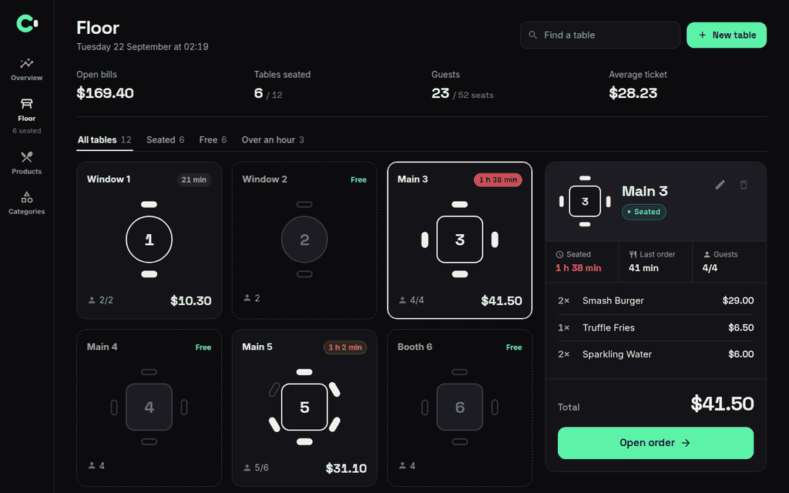

<p align="center"></p>
<p align="center">Tables, orders and bills for a restaurant.</p>



Most point of sale screens are a list of table numbers next to a list of
amounts. I wanted the floor to look like a floor: every table drawn with its
chairs, the chairs filling in as people sit down, and a clock on each one that
turns red when it has been waiting too long.

From there you take the order, split the bill item by item, change a price by
clicking on it, and see how the day went.

## Run it

```bash
make db_up

SPRING_DATASOURCE_URL=jdbc:postgresql://localhost:5432/contappa_db \
  ./contappa-core/mvnw -f contappa-core spring-boot:run

cd contappa-web && cp .env-example .env && npm install && npm run dev
```

Docker, Java 21 and Node 20. The app is on `localhost:5173`, the API on
`localhost:8080`.

Nothing starts empty. The database seeds itself with a menu, a floor, six open
bills and a day of sales. `make db_reload` throws it all away and starts over.

## The API

Spring Boot over PostgreSQL. The contract lives in `doc/openapi.yaml` and the
web types are generated from it, so the two cannot drift apart quietly.

Every `PATCH` is partial. Every error has the same shape. A split that does
not add up to the original bill is refused.

`make test`, `make check` and `make ci-tests` are what CI runs, plus a lint of
the contract.

---

The photos are from Unsplash. The restaurant does not exist.
